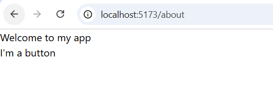
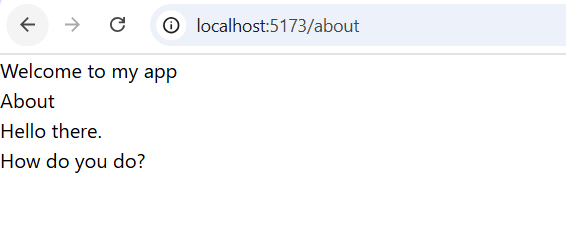
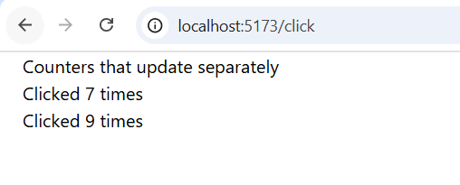
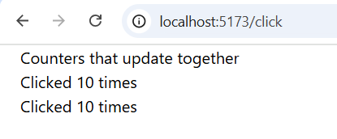

<h1>Практичне заняття №5</h1>
<h3>Ознайомлення з React через інтерактивний туторіал, основи компонентного підходу</h3>

Мною було опрацьовано розділ <strong>"Швидкий старт React"</strong> та виконано завдання, що в ньому містились.

На зображенні показано виконання завдання №1 — створення простих компонентів, які виводять відповідний текст. 
Пізніше файл About.tsx був відредагований і тепер відображає інший текст.

Ось приклад:

Наступним кроком була реалізація кнопок, які рахують кількість кліків (файл Buttons.tsx). 
Було використано обробник події handleClick:

Пізніше компонент був змінений так, щоб однаковий state використовувався для обох кнопок — тобто кліки рахувались загально. (Click.tsx)

Останнім завданням було створення списку продуктів (файл List.tsx).

Ось приклад:

